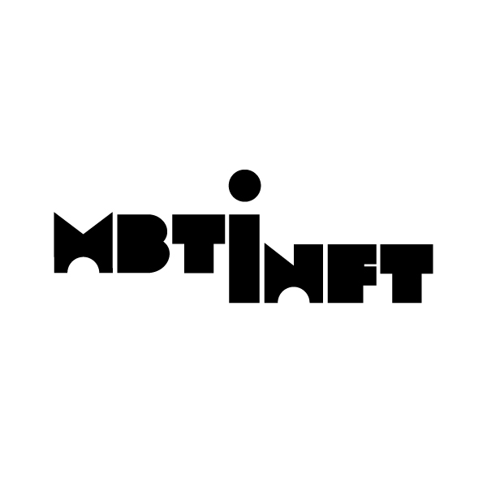
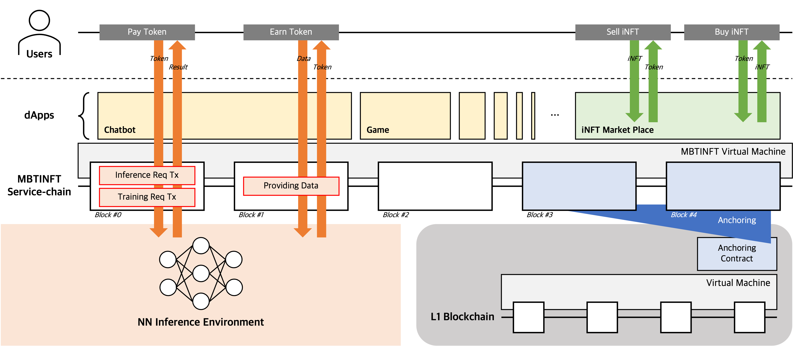

[🇰🇷 | Korean | 한국어](./README.md)

[🇺🇸 | English | 영어](./README_EN.md)

---

# MBTINFT



```
MBTI + iNFT = MBTINFT
```

# Overview

**MBTINFT**는 우리에게 MBTI로 널리 알려져 있는 마이어스-브릭스 유형 지표(Myers-Briggs-Type Indicator)에 바탕을 둔 성격을 NFT로 형성하는 프로젝트입니다.

네, 성격을 NFT 마켓을 통해 거래할 수 있습니다. 마음에 드는 성격을 구매해 대화상대로 쓸 수 있고, 창작활동을 시킬 수 있죠. **MBTINFT** 생태계 위에 어떤 탈중앙화 응용프로그램들이 업로드되는지, 사용자가 어떻게 활용하는지에 따라 그 가능성은 무궁무진합니다.

학습을 통해 성격을 보다 발전시킬수도 있습니다. *내 데이터*를 이용해 *내가 소유한 성격*을 *내가 원하는 방향*으로 학습시킬 수 있습니다. 심지어는 이를 다시 NFT 마켓을 통해 되팔 수도 있습니다. 마치 게임에서 아이템을 다루듯이 말이죠! 내 전용 아이템으로 만들거나, 강화한 후 되팔거나.

프롬프트 엔지니어링을 비롯한 최신 인공지능 방법론의 수혜를 받은 심층신경망(DNN)이 성격을 구현하기 위해 사용됩니다. 이 신경망은 사용자의 요청을 훌륭하게 처리하고, 성격에 따른 가장 적합한 추론 결과를 제공합니다. 예를 들어 내가 소유한 성격이 INTP에 가깝다면, 그는 공감능력이 떨어지기 때문에 (그런 데이터들로 학습했기 때문에) 당신과의 대화에서 "영혼없는 리액션"을 할 수도 있습니다.

> INTP를 욕하는 것이 아닙니다. 이 글을 작성하는 저도 INTP입니다! 그리고 INTP가 공감능력이 떨어지는게 아니라 고심을 많이하고 행동과 발언을 조심하는건데 다들 공감능력이 떨어진다고 그러고 막... 막 그러고 후... 여기까지.

아무튼. **MBTINFT**를 통해 MBTI로 표현되는 나만의 성격을 소유하고, 이 성격을 통해 다양한 탈중앙화 응용프로그램을 사용해보세요. 데이터를 제공해 토큰 보상을 받고, 토큰을 사용해 **MBTINFT**를 거래하거나 학습시켜보세요. 혹은 당신이 개발자라면, 성격에 기반한 다양한 응용프로그램을 설계하고 수수료로 토큰을 확보해보세요.

그리고 가장 놀라운 사실. 이 모든 활동은 완전히 탈중앙화된 블록체인 위에서 이루어집니다. **MBTINFT** 팀은 신경망 추론을 탈중앙화를 해치지 않고 수행하기 위해 각고의 노력을 기울였습니다. 새 키워드를 담아 이더리움가상머신(EVM)을 수정했고, 이를 서비스체인으로 구동해 빠른 속도와 확장성을 확보했습니다. 이 독창적인 블록체인 구조는 탈중앙화를 해치지 않고 iNFT를 구축할 수 있게 합니다.

# Background

작성 중

* MBTI
* iNFT

<!--
## MBTI

## iNFT
-->

# Features



작성 중

* Artificial Intelligent (AI)
* Service-chain & Anchoring
* Decentralized Applications
* Example of MBTINFT dApp

<!--
## Artificial Intelligent (AI)

**MBTINFT**의 핵심은 개체간 성격차이가 잘 드러나는 추론을 가능케하는 심층신경망에 있습니다. 어느 iNFT는 

## Service-chain & Anchoring

## Decentralized Applications

## Example of MBTINFT dApp

Figma
-->

# Roadmap

TBA

# Thanks for your interest

**MBTINFT** 팀은 블록체인의 탈중앙화 철학을 중시하며, 자생하는 생태계의 구축 방법과 주도적인 참여를 유도할 방법을 항시 고민하고 있습니다.

이번 **MBTINFT** 프로젝트로부터 인공지능과 블록체인의 성공적인 결합, 그리고 그 과정 속에서도 탈중앙화 정신을 놓치지 않는 솔루션을 제시하고자 합니다.

우리는 디파이, NFT, DAO, 그 외의 여러 용처들이 펼쳐갈 블록체인의 무궁한 미래를 함께할 것입니다. 관심있게 지켜봐주시면 감사하겠습니다.

# Contact

Luke Park (Sanghyeon Park)

> [🖥 https://github.com/lukepark327](https://github.com/lukepark327)\
> [✉️ lukepark327@gmail.com](mailto:lukepark327@gmail.com)

# License

The **MBTINFT** project is licensed under the [MIT](https://opensource.org/licenses/MIT), also included in our repository in the [LICENSE](./LICENSE) file.
